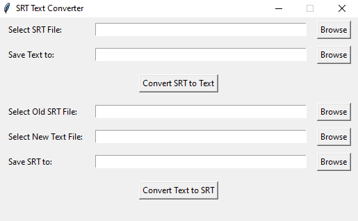

# SRT-Text-Converter

## Brief

SRT Text Converter is a Python app with a GUI built using Tkinter. It offers two main functionalities: converting SRT files to text and vice versa. It allows users to manipulate subtitle files easily.

## Snapshot



## Workflow Explanation

The tool provides two primary modes:

1. **SRT to Text**: This mode enables users to select an SRT file via the GUI, choose a destination for the text file, and remove timestamps and subtitle indexes, keeping only the textual content.

2. **Text to SRT**: In this mode, users can replace existing subtitles with new ones. Users select the original subtitle SRT file and provide the new subtitles as plain text, with each line representing a new subtitle. The tool preserves timestamps and IDs while replacing the subtitle lines.

## Setup Instructions

### Using Python

It can be run directly with Python and does not require external dependencies.

Run:
   ```bash
   python main.py
   ```

### Using Executables

1. Download the pre-built executable from the releases section.
2. Double-click the executable to run the tool.
